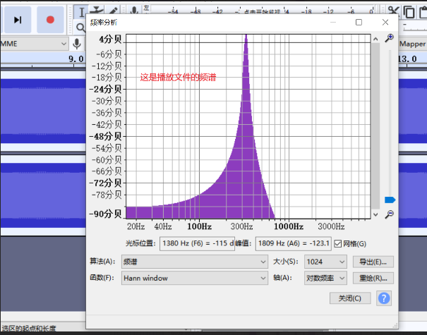
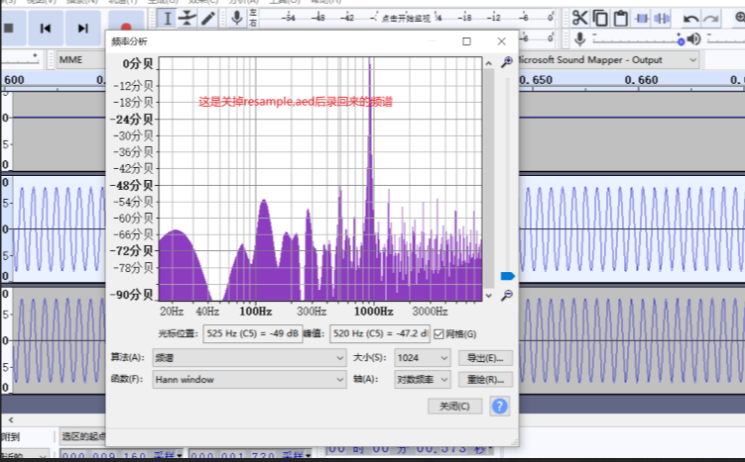

---
20230808
开机后loopback频谱不正常
---

# 20230808

今天在贵哥问张清a4 录音不正常的时候我检查了一下本地的loopback情况，发现开机后用

```
aplay -Dhw:0,1 1khz_s16_16k.wav &
arecord -Dhw:0,4 -c 4 -r 16000 -f S16_LE -d 5 A5-2.wav
```

命令录出来的音频频谱不正常，之前只关注了是否有声音，波形是否是正弦波，但没关注频谱。

现象是：

关掉resample,aed,然后用上面的命令进行录音，停掉了audioservice,发现录到的波形频谱不正常





我用同样的方法在A5上做实验，发现A5上也有相同的现象，关掉audioservice，测试命令为：

```
aplay -Dhw:0,1 1khz_s16_16k.wav &
arecord -Dhw:0,4 -c 16 -r 16000 -f S16_LE -d 5 A5-2.wav
```

# 20230809

|             | 录音通道数 | 关掉resample，aed | loopback录音前后频率是否一致 |
| ----------- | ---------- | ----------------- | ---------------------------- |
| A4 speaker  | 4          | yes               | yes                          |
| A4 soundbar | 4          | yes               | No                           |
| A5 soundbar | 16         | yes               | No                           |

